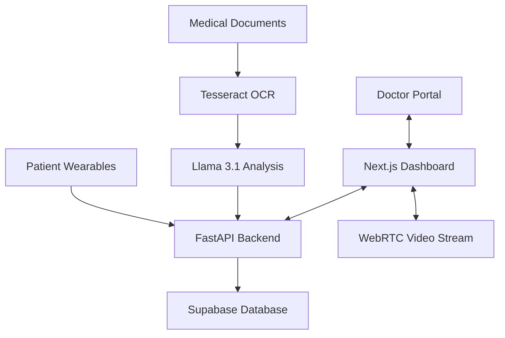

# 🧬 CuraTrack V2 — Unified Health Ecosystem

**CuraTrack V2** is a modular, high-performance healthcare management platform designed with "Empathetic Precision." It unifies patient wearables, medical records, and telemedicine into a single, secure environment powered by AI-driven insights.

---

## 🚀 Core Features

### 🧠 AI Health Intelligence (Ollama + Llama 3.1)
- **Clinical Ingestion**: Automated health record processing using **Tesseract OCR**. Parses prescriptions and lab results from images/PDFs directly into your digital history.
- **Dynamic Risk Radar**: An AI engine that analyzes seasonal and localized data to provide context-aware health precautions and disease outbreak alerts.
- **Intelligent Schemes**: AI-driven eligibility check for government and private insurance schemes based on demographic and medical profiles.

### 🎥 Telemedicine Hub (WebRTC + P2P)
- **Instant Video Consults**: Secure, room-based video calling with zero-infrastructure signaling via **Supabase Realtime Broadcast**.
- **Real-time Vitals Sync**: Doctors can view live heart rate and activity metrics from the patient during the call for more accurate remote diagnosis.
- **Professional Lobby**: A clinical-grade lobby system for patients and doctors to manage consultations seamlessly.

### 🔐 Security & Privacy (The "PASSPORT" System)
- **Patient Passport**: Scoped, one-time-use access tokens that allow clinicians to view specific segments of medical history without full record exposure.
- **Dynamic QR Health ID**: Expiring QR codes for secure, transient access in emergency or clinical settings.
- **End-to-End Encryption**: All sensitive medical documents and vitals are encrypted at rest and in transit using industry-standard protocols.

### 📱 Unified Patient Dashboard
- **Activity & Fit Dashboard**: Real-time tracking of **Heart Rate**, **Steps**, and **Sleep Quality** with visual trend analysis using Recharts.
- **Smart Wellness Nudges**: AI-interpreted wellness advice: *"Your HRV is lower than usual. We recommend a 5-minute breathing session."*
- **Clinical Design System**: A premium, accessibility-focused UI built with a refined teal-clinical color palette.

---

## 🛠️ Technical Architecture

### Tech Stack
| Layer | Technology |
| :--- | :--- |
| **Frontend** | Next.js 15+ (App Router), React 19, Tailwind CSS (V4), TypeScript |
| **Backend** | Python 3.10+, FastAPI, Uvicorn, Pydantic |
| **AI/OCR** | Llama 3.1:8b (via Ollama), Tesseract OCR |
| **Database/Auth** | Supabase (PostgreSQL), Supabase Auth |
| **Video/Signaling** | WebRTC (P2P), Supabase Realtime (Signaling) |

### System Integration


---

## 🎨 Clinical Design System
CuraTrack V2 uses a custom design system optimized for clarity and trust:
- **Primary**: `#006782` (Deep Clinical Teal)
- **Secondary**: `#35B0AB` (Aquamarine Accent)
- **Neutral**: `#F8F9FA` (Clean Clinical White)
- **Typography**: `Manrope` for Headlines, `Inter` for Body/Labels.

---

## ⚙️ Local Setup

### 1. Prerequisites
- **Ollama**: [Download](https://ollama.com/) and run `ollama pull llama3.1`
- **Tesseract OCR**: Install the engine on your system ([Guide](https://github.com/tesseract-ocr/tesseract))
- **Environment**: Node.js 18+ and Python 3.10+

### 2. Backend Installation
```bash
cd backend
python -m venv .venv
source .venv/bin/activate  # Windows: .venv\Scripts\activate
pip install -r requirements.txt
python -m uvicorn main:app --reload
```

### 3. Frontend Installation
```bash
cd frontend
npm install
npm run dev
```

---

## 📜 Privacy & Compliance
CuraTrack adheres to HIPAA-inspired data isolation principles. All peer-to-peer video sessions are encrypted, and medical record access is enforced via short-lived Row-Level Security (RLS) policies in Supabase.

**"CuraTrack: Empathetic Precision in Modern Care"**
