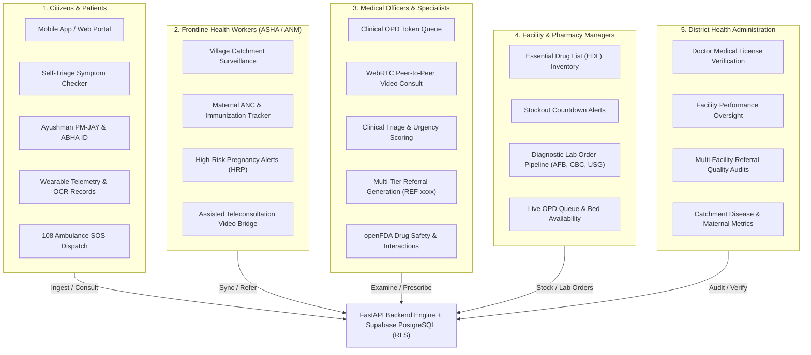

# 🧬 CuraTrack V3 — Unified AI Healthcare & Public Health Ecosystem

[](https://nextjs.org/)
[](https://fastapi.tiangolo.com/)
[](https://expo.dev/)
[](https://supabase.com/)
[](https://webrtc.org/)
[](LICENSE)

> **Empathetic Precision in Modern Digital Public Health** — **CuraTrack V3** is a comprehensive, production-grade healthcare ecosystem designed for India's public and rural health infrastructure. It bridges citizens, ASHA frontline health workers, primary health centres (PHCs), community health centres (CHCs), and district hospitals through seamless digital clinical triage, end-to-end referral pipelines, EDL drug stock tracking, real-time wearable telemetry, peer-to-peer WebRTC teleconsultation, and emergency 108/112 dispatch.

---

## 🏛️ Comprehensive Architecture & Stakeholder Flow


```mermaid
graph TD
    subgraph Citizens["1. Citizens & Patients"]
        P1["Mobile App / Web Portal"]
        P2["Self-Triage Symptom Checker"]
        P3["Ayushman PM-JAY & ABHA ID"]
        P4["Wearable Telemetry & OCR Records"]
        P5["108 Ambulance SOS Dispatch"]
    end

    subgraph Frontline["2. Frontline Health Workers (ASHA / ANM)"]
        F1["Village Catchment Surveillance"]
        F2["Maternal ANC & Immunization Tracker"]
        F3["High-Risk Pregnancy Alerts (HRP)"]
        F4["Assisted Teleconsultation Video Bridge"]
    end

    subgraph Clinical["3. Medical Officers & Specialists"]
        D1["Clinical OPD Token Queue"]
        D2["WebRTC Peer-to-Peer Video Consult"]
        D3["Clinical Triage & Urgency Scoring"]
        D4["Multi-Tier Referral Generation (REF-xxxx)"]
        D5["openFDA Drug Safety & Interactions"]
    end

    subgraph Operations["4. Facility & Pharmacy Managers"]
        H1["Essential Drug List (EDL) Inventory"]
        H2["Stockout Countdown Alerts"]
        H3["Diagnostic Lab Order Pipeline (AFB, CBC, USG)"]
        H4["Live OPD Queue & Bed Availability"]
    end

    subgraph Governance["5. District Health Administration"]
        A1["Doctor Medical License Verification"]
        A2["Facility Performance Oversight"]
        A3["Multi-Facility Referral Quality Audits"]
        A4["Catchment Disease & Maternal Metrics"]
    end

    Citizens -->|Ingest / Consult| CoreBackend["FastAPI Backend Engine + Supabase PostgreSQL (RLS)"]
    Frontline -->|Sync / Refer| CoreBackend
    Clinical -->|Examine / Prescribe| CoreBackend
    Operations -->|Stock / Lab Orders| CoreBackend
    Governance -->|Audit / Verify| CoreBackend
```

---

## 🔑 5-Tier Public Health Role Architecture (RBAC)

CuraTrack V3 implements strict **1-user-1-role access control**. Users are strictly scoped to their designated portal upon authentication without cross-role leakage:

| Stakeholder Role | Portal Route | Primary Capabilities | Default Demo Credentials |
| :--- | :--- | :--- | :--- |
| 👤 **Patient / Citizen** | `/dashboard` | Wearables vitals sync, symptom self-triage, instant & scheduled doctor consult, OCR prescription records, Ayushman Bharat PM-JAY schemes, scoped QR passport, 108 SOS. | `patient@curatrack.in`<br>`Patient@123` |
| 🩺 **Medical Officer / Doctor** | `/doctor`<br>`/doctor/clinical-schedule` | Clinical OPD patient queue, incoming video call ringer, clinical triage scoring, multi-tier referral generation (`REF-xxxx`), diagnostic orders, openFDA drug interaction safety. | `doctor@curatrack.in`<br>`Doctor@123` |
| 👩‍⚕️ **ASHA / ANM Frontline Worker** | `/fhw` | Village catchment roster, Maternal ANC tracking (ANC 1-4), child immunization tracker, rural beneficiary registration, assisted teleconsultation video bridge. | `asha@curatrack.in`<br>`Asha@123` |
| 🏥 **Facility & Pharmacy In-Charge** | `/facility` | Essential Drug List (EDL) stock management, Days of Supply calculation, diagnostic lab test queue (CBC, AFB, Ultrasound), live OPD token number and bed tracking. | `facility@curatrack.in`<br>`Facility@123` |
| 🏛️ **District Health Administrator** | `/admin` | Medical Officer verification (`DOC-KEY-2025`), district facility inventory audit, referral quality track, maternal/child mortality prevention metrics. | `admin@curatrack.in`<br>`Admin@123` |

---

## ✨ In-Depth Feature Breakdown

### 🚨 1. Digital Clinical Triage System (`/triage`)
* **10-Body-System Clinical Taxonomy**: Covers Cardiovascular, Respiratory, Neurological, Gastrointestinal, Maternal/Obstetric, Trauma, Endocrine, Infectious, Renal, and Dermatological conditions.
* **Intelligent Urgency Classification**:
  * 🔴 **RED (Emergency)**: Life-threatening indicators triggering automatic advice for immediate **108 Indian Ambulance dispatch** and tertiary care referral.
  * 🟡 **YELLOW (Priority)**: Significant symptoms requiring Primary/Community Health Centre attention within 4 hours.
  * 🟢 **GREEN (Routine)**: Stable conditions managed via OPD appointments, assisted teleconsultation, or local dispensary care.
* **Tiered Facility Router**: Recommends exact care tier (**Sub-Centre (SC)** ➔ **Primary Health Centre (PHC)** ➔ **Community Health Centre (CHC)** ➔ **District Hospital**).
* **1-Click Auto-Booking & Referral Pipeline**: Converts triage outputs immediately into a confirmed doctor visit or referral pass.

### 🔄 2. End-to-End Referral Pipeline (`/referrals`)
* **Public Health Referral Lifecycle**: Tracks patient flow across `INITIATED` ➔ `PENDING_REVIEW` ➔ `ACCEPTED` ➔ `SCHEDULED` ➔ `COMPLETED` / `REJECTED`.
* **Unique Identification**: Generates cryptographically secure, traceable referral codes (e.g. `REF-2026-8921`).
* **Clinical Handshake & Continuity of Care**: Encapsulates clinical summary, tentative diagnosis, requested investigation, transport modality (108 Ambulance / Patient Travel), and receiving physician notes.

### 👩‍⚕️ 3. Frontline Health Worker (ASHA / ANM) Catchment Suite (`/fhw`)
* **Village Population Surveillance**: Comprehensive roster tracking rural beneficiaries across age, socio-economic band, and health vulnerability.
* **Maternal ANC Milestones**: Automated tracking of Antenatal Care checkups (ANC1 at registration, ANC2 at 14–26 weeks, ANC3 at 28–34 weeks, ANC4 at 36 weeks).
* **Under-5 Immunization Surveillance**: National immunization schedule tracker for BCG, OPV, Pentavalent, Rotavirus, Measles-Rubella (MR), and DPT boosters.
* **High-Risk Pregnancy (HRP) Radar**: Instant flags for severe anemia ($Hb < 7\text{ g/dL}$), gestational hypertension, previous C-section history, and adolescent pregnancy.
* **Assisted Teleconsultation Bridge**: Enables ASHA workers to initiate joint WebRTC video calls bridging remote rural patients with district medical officers in real time.

### 🏥 4. Facility Operations, EDL Drug Inventory & Diagnostics (`/facility`)
* **Essential Medicine List (EDL) Management**: Live inventory tracking for public health medicines (Amoxicillin, Metformin, ORS, IFA tablets, Paracetamol, etc.).
* **Days of Supply & Stockout Radar**: Automated mathematical countdown of remaining stock based on daily burn rate with high-visibility alerts when inventory drops below 7 days.
* **Diagnostic Lab Order Pipeline**: End-to-end lab workflow management for Complete Blood Count (CBC), Sputum AFB (Tuberculosis), Ultrasound Obstetrics, Rapid Malaria Dipstick, and ECG.
* **Live OPD Token Queue & Bed Capacity**: Real-time tracking of active consultation token numbers and inpatient ward occupancy.

### 🎥 5. Zero-Latency WebRTC P2P Telemedicine (`/call/[roomId]`)
* **Direct Peer-to-Peer Media Streaming**: Real-time audio and video transmission utilizing Google STUN servers and Supabase Realtime broadcast channels for SDP offer/answer signaling.
* **Incoming Call Ringer for Doctors**: Live audio chime and visual popups on the doctor's dashboard when a patient or ASHA worker connects to their room.
* **In-Call Clinical Tools**: Dynamic consultation timer, device switching (mic, camera, speaker), and auto-cleanup upon call completion.

### 📄 6. Multimodal OCR Document Ingestion (`/records`)
* **Dual-Engine OCR**: Ingests printed prescriptions, lab summaries, and diagnostic reports using **Tesseract OCR v5** and **Google Gemini API** (`gemini-flash-latest`) or offline **Ollama (Llama 3.1:8b)**.
* **Structured Data Extraction**: Automatically detects medications, dosages, frequency, test biomarkers, and physician impressions and records them directly into the patient's database timeline.

### 💊 7. openFDA Drug Interaction & Safety Engine (`/drug-checker`)
* **Official openFDA Integration**: Real-time cross-referencing against the official United States Food and Drug Administration (openFDA) database.
* **Multi-Drug Collision Detection**: Detects severe contraindications, synergistic toxicities, and recommended dosage intervals for multi-drug regimens.

### 🎫 8. Encrypted Patient Passport & Scoped Emergency QR (`/passport`)
* **Time-Bound 256-Bit Tokens**: Generates signed, auto-expiring JWT tokens encoded into QR codes for emergency first responders and external specialists.
* **Configurable Scopes**: Granular access control selecting whether emergency viewers can see Vitals, Allergies, Medications, Diagnoses, or Insurance.
* **Immutable Audit Logging**: Logs every QR scan with timestamp, IP address, and accessing clinician identifiers.

### 📱 9. Fully Database-Driven Mobile Application (`mobile/`)
* **100% Database-Driven**: Zero mock or hardcoded data—all profiles, scheduled appointments, prescriptions, uploaded records, and notifications are bound to Supabase PostgreSQL.
* **Google Fit Wearable Telemetry**: Real-time synchronization of step count, resting heart rate, blood oxygen ($SpO_2$), and sleep duration via `/api/fit-data`.
* **Local Emergency Protocols**: Dedicated **108 Indian Ambulance Emergency SOS** and **112 National Emergency Dispatch** buttons with instant telemetry transmission.

---

## 🛠️ Complete Technology Stack

| Tier | Component | Technology |
| :--- | :--- | :--- |
| **Web Frontend** | Core Framework | Next.js 15+ (App Router & Turbopack), React 19, TypeScript |
| | Styling & Components | Vanilla Tailwind CSS v4, Lucide Icons, Material Symbols, Framer Motion |
| **Mobile App** | Core Framework | React Native (Expo SDK 54), Expo Router, TypeScript |
| | Native Build | Standalone Android Gradle Project (`/android`) |
| **Backend API** | Server Framework | Python 3.10+, FastAPI, Uvicorn, Pydantic v2, HTTPX |
| **AI & Vision** | Multimodal LLMs | Google Gemini API (`gemini-flash-latest`), Ollama Llama 3.1 |
| | OCR Engine | Tesseract OCR v5 (Bundled Windows binaries included) |
| **Database & Realtime** | Data Storage | Supabase PostgreSQL with Row Level Security (RLS) |
| | Signaling & Auth | Supabase Auth, SSR Middleware, Supabase Realtime Channels |
| **Integrations** | External APIs | openFDA REST API, Google Fit REST API, STUN/WebRTC |

---

## 📁 Repository Structure

```
curatrack/
├── backend/                        # Python FastAPI Microservice Backend
│   ├── routes/                     # API Routers (OCR, FDA, Passport, Vitals, SDOH, Onboarding, Triage, Referrals, FHW, Facility)
│   │   ├── triage.py               # Digital clinical triage & urgency scoring
│   │   ├── referrals.py            # End-to-end referral pipeline (REF-xxxx)
│   │   ├── fhw.py                  # ASHA / ANM village catchment & maternal ANC
│   │   ├── facility.py             # EDL medicine stock & diagnostic lab orders
│   │   ├── passport.py             # Encrypted QR passport generation & verification
│   │   ├── drug_interactions.py    # openFDA drug safety checker
│   │   └── onboarding.py           # 5-tier stakeholder onboarding
│   ├── services/                   # Business logic (Audit logger, patient data, OCR ingestion)
│   ├── main.py                     # FastAPI application entry point & CORS configuration
│   └── requirements.txt            # Python dependencies
├── frontend/                       # Next.js 15 Web Application
│   ├── app/                        # Next.js App Router
│   │   ├── (dashboard)/            # Authenticated stakeholder routes
│   │   │   ├── dashboard/          # Citizen / Patient health overview
│   │   │   ├── triage/             # Digital Clinical Triage Suite
│   │   │   ├── referrals/          # Public Health Referral Tracking Pipeline
│   │   │   ├── fhw/                # ASHA Frontline Worker Catchment Center
│   │   │   ├── facility/           # Facility Operations, EDL Stock & Lab Pipeline
│   │   │   ├── telemedicine/       # WebRTC Video Consult Launcher
│   │   │   ├── records/            # OCR Medical Document Archive
│   │   │   ├── benefits/           # PM-JAY & Ayushman Bharat Scheme Ingestion
│   │   │   └── bluetooth/          # Zero-Internet BLE Offline Handshake
│   │   ├── doctor/                 # Medical Officer OPD Queue & Schedule
│   │   ├── admin/                  # District Administrator Portal & Verification
│   │   ├── call/[roomId]/          # WebRTC P2P Video Call Interface
│   │   ├── login/                  # 5-Tier 1-Click Demo Login & Authentication
│   │   └── api/                    # Next.js Serverless Route Handlers
│   ├── components/                 # UI components (SideNavBar, TopNavBar, DoctorPortal)
│   └── lib/supabase/               # Supabase SSR client, server, and middleware
├── mobile/                         # Expo React Native Mobile Application
│   ├── app/                        # Mobile screen routes (Home, Vitals, Appointments, Records, Medications, Schemes, Emergency, Login)
│   ├── context/                    # AppContext (Live Supabase database-driven state management)
│   ├── lib/                        # Mobile API clients, Supabase client, Google Fit sync
│   └── __tests__/                  # Mobile Vitest and Component Test Suites
├── tests/                          # Automated Verification Test Suite (40 Pytest tests)
│   ├── test_backend_core.py        # Core API health & SDOH tests
│   ├── test_triage_and_referrals.py# Triage scoring & referral lifecycle tests
│   ├── test_fhw.py                 # ASHA catchment & maternal ANC tests
│   ├── test_facility_and_rbac.py   # Facility EDL inventory & RBAC tests
│   ├── test_passport_security.py   # JWT token encryption & QR expiry tests
│   └── run_all_tests.py            # Master test execution script
├── render.yaml                     # Production Cloud Deployment Manifest
└── README.md                       # Master Documentation
```

---

## ⚙️ Quick Start & Local Setup Guide

### 📋 Prerequisites
- **Node.js**: v18.0.0 or higher
- **Python**: v3.10 or higher
- **Supabase Project**: Free tier or self-hosted Supabase instance

---

### 1. Backend Engine (FastAPI)

```bash
# Navigate to backend
cd backend

# Create and activate Python virtual environment
python -m venv .venv

# On Windows:
.venv\Scripts\activate
# On macOS/Linux:
source .venv/bin/activate

# Install dependencies
pip install -r requirements.txt

# Launch FastAPI Server
python -m uvicorn main:app --reload --port 8000
```
*Interactive Swagger API documentation will be available at `http://localhost:8000/docs`.*

---

### 2. Web Frontend (Next.js 15)

```bash
# Navigate to frontend
cd frontend

# Install dependencies
npm install

# Run the development server
npm run dev
```
*Open `http://localhost:3000` in your browser. Use the **1-Click Stakeholder Demo Logins** on `/login` to test any of the 5 roles instantly.*

---

### 3. Mobile Application (React Native / Expo)

```bash
# Navigate to mobile
cd mobile

# Install dependencies
npm install

# Run tests
npm test

# Launch mobile development server
npm run dev
```
*Open `http://localhost:3001` or scan the QR code via **Expo Go**.*

---

## 🛡️ Master Automated Test Suite

To guarantee that database contracts, triage logic, referral lifecycles, and security tokens remain 100% stable:

```bash
# Run all 40 automated test cases
python tests/run_all_tests.py
```

### Test Suite Execution Output:
```text
======================================================================
  [CURATRACK PRE-PUSH VERIFICATION SUITE]
======================================================================
tests/test_backend_core.py ...........                                  [ 17%]
tests/test_drug_and_vitals.py .....                                     [ 30%]
tests/test_facility_and_rbac.py .....                                   [ 42%]
tests/test_fhw.py ....                                                  [ 52%]
tests/test_frontend_mobile_build.py ...                                 [ 60%]
tests/test_mobile_backend_contract.py ......                            [ 72%]
tests/test_offline_ble.py ..                                            [ 77%]
tests/test_passport_security.py ...                                     [ 85%]
tests/test_triage_and_referrals.py ......                               [100%]

====================== 40 passed, 14 warnings in 12.50s =======================
SUCCESS: ALL TESTS PASSED! Your changes are safe to push to production.
```

---

## 🔒 Security, Compliance & Data Governance

* **Indian Health Standards Localized**: Formatted around the **Ayushman Bharat Digital Mission (ABDM)**, **National Health Authority (NHA)**, and **108/112 Emergency Dispatch Protocols**.
* **Supabase Row-Level Security (RLS)**: Enforces cryptographic boundaries on database tables so that patients only access their own records while clinicians only access assigned cases.
* **Zero PII Leakage in Passport QR**: Encrypts transient health passports with signed RS256/HS256 tokens that automatically expire within 5 minutes.
* **Peer-to-Peer Encryption**: Video streams never traverse intermediate media servers, ensuring doctor-patient confidentiality.

---

## 📄 License

Distributed under the **MIT License**. See `LICENSE` for details.

**CuraTrack V3 — Empathetic Precision in Modern Digital Public Health.**
