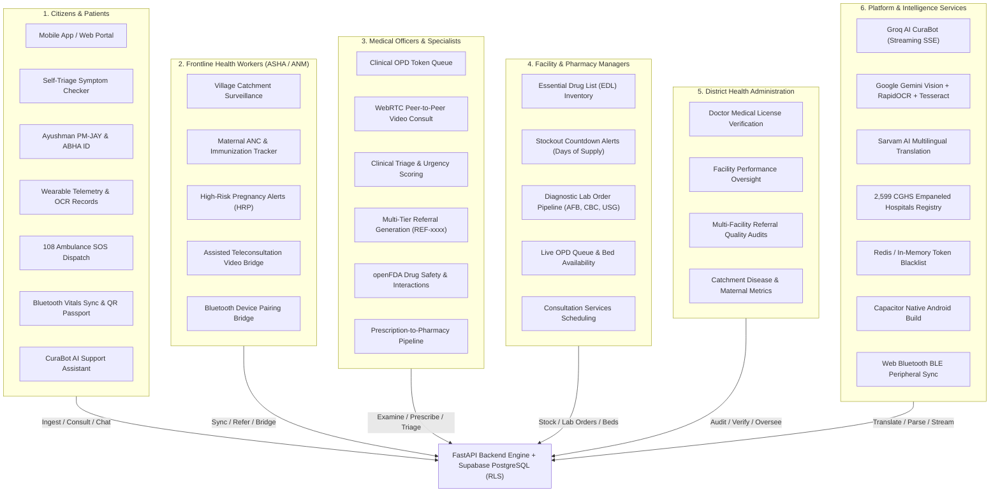

# 🧬 CuraTrack V2 — Unified AI Healthcare & Public Health Ecosystem

[](https://nextjs.org/)
[](https://fastapi.tiangolo.com/)
[](https://groq.com/)
[](https://ai.google.dev/)
[](https://www.sarvam.ai/)
[](https://capacitorjs.com/)
[](https://supabase.com/)
[](https://webrtc.org/)
[](https://data.gov.in/)
[](tests/)
[](LICENSE)

> **Empathetic Precision in Modern Digital Public Health** — **CuraTrack V2** is a comprehensive, production-grade healthcare ecosystem designed for India's public and rural health infrastructure. It bridges citizens, ASHA frontline health workers, primary health centres (PHCs), community health centres (CHCs), and district hospitals through seamless digital clinical triage, end-to-end referral pipelines, EDL drug stock tracking, real-time wearable telemetry, peer-to-peer WebRTC teleconsultation, **Groq-powered CuraBot AI clinical support**, **Gemini Vision multimodal OCR document ingestion**, **Sarvam AI multilingual translation (English, Hindi, Marathi, Tamil)**, **2,599 CGHS empaneled hospitals lookup**, **Capacitor-powered native Android builds**, **Web Bluetooth medical peripheral integration**, **offline-first progressive caching**, and emergency 108/112 dispatch.

---

## 🏛️ Comprehensive Architecture & Stakeholder Flow


```mermaid
graph TD
    subgraph Citizens["1. Citizens & Patients"]
        P1["Mobile App / Web Portal"]
        P2["Self-Triage Symptom Checker"]
        P3["Ayushman PM-JAY & ABHA ID"]
        P4["Wearable Telemetry & OCR Records"]
        P5["108 Ambulance SOS Dispatch"]
        P6["Bluetooth Vitals Sync & QR Passport"]
        P7["CuraBot AI Support Assistant"]
    end

    subgraph Frontline["2. Frontline Health Workers (ASHA / ANM)"]
        F1["Village Catchment Surveillance"]
        F2["Maternal ANC & Immunization Tracker"]
        F3["High-Risk Pregnancy Alerts (HRP)"]
        F4["Assisted Teleconsultation Video Bridge"]
        F5["Bluetooth Device Pairing Bridge"]
    end

    subgraph Clinical["3. Medical Officers & Specialists"]
        D1["Clinical OPD Token Queue"]
        D2["WebRTC Peer-to-Peer Video Consult"]
        D3["Clinical Triage & Urgency Scoring"]
        D4["Multi-Tier Referral Generation (REF-xxxx)"]
        D5["openFDA Drug Safety & Interactions"]
        D6["Prescription-to-Pharmacy Pipeline"]
    end

    subgraph Operations["4. Facility & Pharmacy Managers"]
        H1["Essential Drug List (EDL) Inventory"]
        H2["Stockout Countdown Alerts (Days of Supply)"]
        H3["Diagnostic Lab Order Pipeline (AFB, CBC, USG)"]
        H4["Live OPD Queue & Bed Availability"]
        H5["Consultation Services Scheduling"]
    end

    subgraph Governance["5. District Health Administration"]
        A1["Doctor Medical License Verification"]
        A2["Facility Performance Oversight"]
        A3["Multi-Facility Referral Quality Audits"]
        A4["Catchment Disease & Maternal Metrics"]
    end

    subgraph Platform["6. Platform & Intelligence Services"]
        T1["Groq AI CuraBot (Streaming SSE)"]
        T2["Google Gemini Vision + RapidOCR + Tesseract"]
        T3["Sarvam AI Multilingual Translation"]
        T4["2,599 CGHS Empaneled Hospitals Registry"]
        T5["Redis / In-Memory Token Blacklist"]
        T6["Capacitor Native Android Build"]
        T7["Web Bluetooth BLE Peripheral Sync"]
    end

    Citizens -->|Ingest / Consult / Chat| CoreBackend["FastAPI Backend Engine + Supabase PostgreSQL (RLS)"]
    Frontline -->|Sync / Refer / Bridge| CoreBackend
    Clinical -->|Examine / Prescribe / Triage| CoreBackend
    Operations -->|Stock / Lab Orders / Beds| CoreBackend
    Governance -->|Audit / Verify / Oversee| CoreBackend
    Platform -->|Translate / Parse / Stream| CoreBackend
```

---

## 🔑 5-Tier Public Health Role Architecture (RBAC)

CuraTrack V2 implements strict **1-user-1-role access control**. Users are strictly scoped to their designated portal upon authentication without cross-role leakage:

| Stakeholder Role | Portal Route | Primary Capabilities | Default Demo Credentials |
| :--- | :--- | :--- | :--- |
| 👤 **Patient / Citizen** | `/dashboard` | Wearables vitals sync, Bluetooth device pairing, symptom self-triage, CuraBot AI assistant, instant & scheduled doctor consult, OCR prescription records, 2,599 CGHS hospitals & PM-JAY schemes, scoped QR passport, health alerts & seasonal outbreak radar, 108 SOS, multilingual UI. | `patient@curatrack.in`<br>`Patient@123` |
| 🩺 **Medical Officer / Doctor** | `/doctor`<br>`/doctor/triage`<br>`/doctor/referrals` | Clinical OPD patient queue, incoming video call ringer, clinical triage scoring, multi-tier referral generation (`REF-xxxx`), prescription-to-pharmacy pipeline with EDL stock deduction, diagnostic orders, openFDA drug interaction safety, Bluetooth vitals intake. | `doctor@curatrack.in`<br>`Doctor@123` |
| 👩‍⚕️ **ASHA / ANM Frontline Worker** | `/fhw`<br>`/fhw/referrals` | Village catchment roster, Maternal ANC tracking (ANC 1-4), child immunization tracker, rural beneficiary registration, assisted teleconsultation video bridge, outbreak alerts, community triage, Bluetooth device bridge. | `asha@curatrack.in`<br>`Asha@123` |
| 🏥 **Facility & Pharmacy In-Charge** | `/facility`<br>`/facility/clinical-schedule`<br>`/facility/consultation-service` | Essential Drug List (EDL) stock management, Days of Supply calculation, diagnostic lab test queue (CBC, AFB, Ultrasound), live OPD token number and bed tracking, consultation services scheduling, doctor roster management. | `facility@curatrack.in`<br>`Facility@123` |
| 🏛️ **District Health Administrator** | `/admin` | Medical Officer verification (`DOC-KEY-2025`), district facility inventory audit, referral quality track, maternal/child mortality prevention metrics. | `admin@curatrack.in`<br>`Admin@123` |

---

## ✨ In-Depth Feature Breakdown

### 🤖 1. CuraBot AI Clinical Support & Navigation Assistant
* **Groq-Powered Conversational Intelligence**: Blazing-fast conversational reasoning powered by Llama 3 via Groq (`/api/chatbot` and `/api/chatbot/stream`).
* **Real-Time Streaming Responses**: Server-Sent Events (SSE) streaming token delivery for immediate, low-latency conversational feedback.
* **Context-Aware Medical Navigation**: Grounded in CuraTrack features, medical record workflows, triage protocols, government scheme qualification, and hospital discovery.
* **Persistent Session State**: Seamless session storage (`sessionStorage`) keeping conversation history intact across page transitions.

### 🚨 2. Digital Clinical Triage System (`/triage`, `/self-triage`)
* **10-Body-System Clinical Taxonomy**: Covers Cardiovascular, Respiratory, Neurological, Gastrointestinal, Maternal/Obstetric, Trauma, Endocrine, Infectious, Renal, and Dermatological conditions.
* **Intelligent Urgency Classification**:
  * 🔴 **RED (Emergency)**: Life-threatening indicators triggering automatic advice for immediate **108 Indian Ambulance dispatch** and tertiary care referral.
  * 🟡 **YELLOW (Priority)**: Significant symptoms requiring Primary/Community Health Centre attention within 4 hours.
  * 🟢 **GREEN (Routine)**: Stable conditions managed via OPD appointments, assisted teleconsultation, or local dispensary care.
* **Tiered Facility Router**: Recommends exact care tier (**Sub-Centre (SC)** ➔ **Primary Health Centre (PHC)** ➔ **Community Health Centre (CHC)** ➔ **District Hospital**).
* **1-Click Auto-Booking & Referral Pipeline**: Converts triage outputs immediately into a confirmed doctor visit or referral pass.
* **Doctor Triage Dashboard (`/doctor/triage`)**: Live incoming triage alerts with consult pathway router (in-person visit vs teleconsultation).

### 🔄 3. End-to-End Referral Pipeline (`/referrals`)
* **Public Health Referral Lifecycle**: Tracks patient flow across `INITIATED` ➔ `PENDING_REVIEW` ➔ `ACCEPTED` ➔ `SCHEDULED` ➔ `COMPLETED` / `REJECTED`.
* **Unique Identification**: Generates cryptographically secure, traceable referral codes (e.g. `REF-2026-8921`).
* **Clinical Handshake & Continuity of Care**: Encapsulates clinical summary, tentative diagnosis, requested investigation, transport modality (108 Ambulance / Patient Travel), and receiving physician notes.
* **Multi-Role Referral Access**: Dedicated views for Doctors (`/doctor/referrals`), FHW (`/fhw/referrals`), and Admin (`/referrals`) with role-specific actions and audit trails.
* **ABHA ID Integration**: Links referrals to Ayushman Bharat Health Account identifiers for national health record continuity.

### 👩‍⚕️ 4. Frontline Health Worker (ASHA / ANM) Catchment Suite (`/fhw`)
* **Village Population Surveillance**: Comprehensive roster tracking rural beneficiaries across age, socio-economic band, and health vulnerability.
* **Maternal ANC Milestones**: Automated tracking of Antenatal Care checkups (ANC1 at registration, ANC2 at 14–26 weeks, ANC3 at 28–34 weeks, ANC4 at 36 weeks).
* **Under-5 Immunization Surveillance**: National immunization schedule tracker for BCG, OPV, Pentavalent, Rotavirus, Measles-Rubella (MR), and DPT boosters.
* **High-Risk Pregnancy (HRP) Radar**: Instant flags for severe anemia ($Hb < 7\text{ g/dL}$), gestational hypertension, previous C-section history, and adolescent pregnancy.
* **Assisted Teleconsultation Bridge**: Enables ASHA workers to select beneficiaries and initiate joint WebRTC video calls bridging remote rural patients with district medical officers in real time.
* **Community Triage & Outbreak Alerts**: Direct access to clinical triage and seasonal health outbreak notifications for proactive village-level surveillance.

### 🏥 5. Facility Operations, EDL Drug Inventory & Diagnostics (`/facility`)
* **Essential Medicine List (EDL) Management**: Live inventory tracking for public health medicines (Amoxicillin, Metformin, ORS, IFA tablets, Paracetamol, Ceftriaxone, Amlodipine, Tetanus Toxoid, etc.).
* **Days of Supply & Stockout Radar**: Automated mathematical countdown of remaining stock based on daily burn rate with high-visibility alerts when inventory drops below 7 days.
* **Diagnostic Lab Order Pipeline**: End-to-end lab workflow management for Complete Blood Count (CBC), Sputum AFB (Tuberculosis), Ultrasound Obstetrics, Rapid Malaria Dipstick, and ECG.
* **Live OPD Token Queue & Bed Capacity**: Real-time tracking of active consultation token numbers and inpatient ward occupancy with ward-level bed breakdown (General Male/Female, Pediatric, Maternity, ICU, Isolation).
* **Consultation Services Scheduling (`/facility/clinical-schedule`, `/facility/consultation-service`)**: Manages doctor appointment slots, consultation service calendars, and clinic session planning.
* **Prescription-to-Pharmacy Pipeline**: Doctor prescriptions auto-deduct from facility EDL stock; non-inventory medicines surface "Order" buttons for patients while inventory medicines are dispensed directly.

### 🎥 6. Zero-Latency WebRTC P2P Telemedicine (`/call/[roomId]`)
* **Direct Peer-to-Peer Media Streaming**: Real-time audio and video transmission utilizing Google STUN servers and Supabase Realtime broadcast channels for SDP offer/answer signaling.
* **Incoming Call Ringer for Doctors**: Live audio chime and visual popups on the doctor's dashboard when a patient or ASHA worker connects to their room.
* **In-Call Clinical Tools**: Dynamic consultation timer, device switching (mic, camera, speaker), and auto-cleanup upon call completion.

### 📄 7. Multimodal OCR Document Ingestion (`/records`)
* **Multi-Engine OCR with Gemini Vision Fallback**: Ingests printed prescriptions, lab summaries, and diagnostic reports using **Google Gemini Vision API** (`gemini-flash-latest`), **RapidOCR (ONNX Runtime)**, **Tesseract OCR v5**, and offline **Ollama (Llama 3.1:8b)**.
* **Structured Data Extraction**: Automatically detects medications, dosages, frequency, test biomarkers, and physician impressions and records them directly into the patient's database timeline.

### 🏛️ 8. 2,599 CGHS Empaneled Hospitals & PM-JAY Schemes (`/benefits`)
* **Official CGHS Empaneled Hospitals Registry**: Ingests **2,599 CGHS empaneled hospitals and diagnostic centres** nationwide from Open Government Data (data.gov.in).
* **Dynamic Search & Multi-Filter**: Filter by City, State, Specialities (Cardiology, Oncology, Orthopaedics, Nephrology), and NABH/NABL accreditation status.
* **Ayushman Bharat PM-JAY Engine**: Automated eligibility matching based on SECC criteria, socio-economic band, and family composition with cashless claim pre-authorization calculation.

### 💊 9. openFDA Drug Interaction & Safety Engine (`/drug-checker`)
* **Official openFDA Integration**: Real-time cross-referencing against the official United States Food and Drug Administration (openFDA) database.
* **Multi-Drug Collision Detection**: Detects severe contraindications, synergistic toxicities, and recommended dosage intervals for multi-drug regimens.

### 🎫 10. Encrypted Patient Passport & Scoped Emergency QR (`/passport`, `/profile`)
* **Time-Bound 256-Bit Tokens**: Generates signed, auto-expiring JWT tokens encoded into QR codes for emergency first responders and external specialists.
* **Configurable Scopes**: Granular access control selecting whether emergency viewers can see Vitals, Allergies, Medications, Diagnoses, or Insurance.
* **Immutable Audit Logging**: Logs every QR scan with timestamp, IP address, and accessing clinician identifiers.
* **Redis-Backed Token Blacklisting**: Consumed tokens are blacklisted via Redis (or in-memory fallback in dev mode) to prevent replay attacks.

### 🌐 11. Sarvam AI Multilingual Translation Engine
* **4-Language Real-Time Translation**: Full UI translation across **English (en)**, **Hindi (hi)**, **Marathi (mr)**, and **Tamil (ta)** powered by the [Sarvam AI Translation API](https://www.sarvam.ai/).
* **High-Throughput Concurrent Batching**: Translates page-level UI strings via `ThreadPoolExecutor` with automatic batch splitting for optimal API throughput.
* **Server-Side Translation Caching**: In-memory `src:tgt:text` cache eliminates redundant API calls and reduces latency for repeated strings.
* **Frontend `next-intl` Integration**: Client-side `I18nProvider` with `useI18n()` hook, static JSON dictionaries (`messages/en.json`, `hi.json`, `mr.json`, `ta.json`), and live `LanguageToggle` component for instant language switching.

### 📡 12. Web Bluetooth Medical Device Integration (`/bluetooth`)
* **Role-Specific Bluetooth Pairing**: Dedicated Bluetooth device sync pages for Patients (`/bluetooth/patient`), Doctors (`/bluetooth/doctor`), and ASHA workers (`/bluetooth/fhw`).
* **BLE Vitals Intake**: Pairs with Bluetooth Low Energy medical peripherals (pulse oximeters, blood pressure monitors, glucometers) for real-time clinical vitals transmission.
* **API-Backed Device Transfer**: Bluetooth data transfer routes (`/api/bluetooth/transfers`, `/api/bluetooth/requests`, `/api/bluetooth/presence`) for device handoff and presence tracking.

### 🔔 13. Health Alerts & Seasonal Outbreak Radar (`/alerts`)
* **12-Month Seasonal Disease Intelligence**: Comprehensive monthly outbreak data covering Influenza, Dengue, Malaria, Chikungunya, RSV, Typhoid, Leptospirosis, Cholera, Heat Stroke, and more.
* **Real-Time Health News Feed**: Aggregated health advisories and public health news from backend API.
* **Activity & Fitness Summary**: Displays Google Fit synced activity data alongside health risk alerts.
* **Offline-First Caching**: All alerts, health risks, and news are cached to `localStorage` for offline access via `offlineStorage` utility.

### 📱 14. Fully Database-Driven Mobile Application (`mobile/`)
* **100% Database-Driven**: Zero mock or hardcoded data—all profiles, scheduled appointments, prescriptions, uploaded records, and notifications are bound to Supabase PostgreSQL.
* **Google Fit Wearable Telemetry**: Real-time synchronization of step count, resting heart rate, blood oxygen ($SpO_2$), and sleep duration via `/api/fit-data`.
* **Local Emergency Protocols**: Dedicated **108 Indian Ambulance Emergency SOS** and **112 National Emergency Dispatch** buttons with instant telemetry transmission.
* **Medical ID QR Modal**: Patient medical identity QR code generation and display for rapid identification by first responders.

### 👤 15. Profile, Existing Diseases, Allergies & SDOH (`/profile`, `/onboarding`)
* **Existing Diseases & Allergies Tracking**: Comprehensive health profile tracking chronic ailments (Hypertension, Diabetes, Asthma) and drug/food allergies for automatic contraindication warnings.
* **Social Determinants of Health (SDOH) Assessment (`/onboarding/sdoh`)**: Structured questionnaire capturing housing, food security, transportation, employment, and social support metrics.
* **4-Pathway Role Onboarding (`/onboarding`)**: Guided registration flows for Patients, Doctors, ASHA Workers, and Admins with role-specific profile setup and verification steps.

---

## 🛠️ Complete Technology Stack

| Tier | Component | Technology |
| :--- | :--- | :--- |
| **Web Frontend** | Core Framework | Next.js 16.2+ (App Router & Turbopack), React 19, TypeScript |
| | Styling & Components | Tailwind CSS v4, shadcn/ui, Lucide Icons, Material Symbols, Recharts |
| | Internationalization | `next-intl`, Sarvam AI API, Static JSON Dictionaries (EN/HI/MR/TA) |
| | AI Chatbot Widget | CuraBot Floating Assistant (Groq SSE Streaming) |
| | Device Integration | Web Bluetooth API, Capacitor 8.5 (Android Native) |
| | Offline & Caching | `offlineStorage` utility with `localStorage` progressive caching |
| **Mobile App** | Core Framework | Next.js 16.2+, React 19, TypeScript |
| | Native Build | Capacitor 8.5 Android Gradle Project (`frontend/android`) |
| | Components | Bottom NavBar, Top AppBar, Medical ID QR Modal |
| **Backend API** | Server Framework | Python 3.10+, FastAPI (0.115+), Uvicorn, Pydantic v2, HTTPX |
| | Caching & Tokens | Redis (production) / In-Memory Fallback (dev) for token blacklisting |
| | Translation | Sarvam AI API with `ThreadPoolExecutor` concurrent batching |
| **AI, LLM & Vision** | Conversational Support | Groq Cloud API (`llama-3.3-70b-versatile` / `llama3-8b-8192`) |
| | Multimodal Vision & OCR | Google Gemini API (`gemini-flash-latest`), Ollama Llama 3.1, RapidOCR, Tesseract v5 |
| **Database & Realtime** | Data Storage | Supabase PostgreSQL with Row Level Security (RLS) |
| | Signaling & Auth | Supabase Auth, SSR Middleware, Supabase Realtime Channels |
| **Integrations** | External APIs | openFDA REST API, Google Fit REST API, Sarvam AI, CGHS / Data.gov.in, STUN/WebRTC |
| **Testing** | Backend | Pytest (96 automated test cases across 14 test modules) + Coverage |
| | Frontend Website | Vitest + JSDOM (30 component & integration tests) |
| | Mobile App | Vitest + JSDOM (23 component, context & API tests) |
| **CI/CD** | Push Protection | Git Pre-Push Hook + GitHub Actions CI Matrix (Python 3.11 + 3.12) |
| | Deployment | Vercel (Frontend/Mobile), Render (Backend API) |

---

## 📁 Repository Structure

```
curatrack-v2/
├── backend/                        # Python FastAPI Microservice Backend
│   ├── routes/                     # API Routers (22 route modules)
│   │   ├── chatbot.py              # Groq-powered CuraBot support assistant & SSE stream
│   │   ├── triage.py               # Digital clinical triage & urgency scoring
│   │   ├── referrals.py            # End-to-end referral pipeline (REF-xxxx)
│   │   ├── fhw.py                  # ASHA / ANM village catchment & maternal ANC
│   │   ├── facility.py             # EDL medicine stock, beds, lab orders & doctor roster
│   │   ├── passport.py             # Encrypted QR passport generation & verification
│   │   ├── drug_checker.py         # openFDA drug safety checker
│   │   ├── onboarding.py           # 5-tier stakeholder onboarding
│   │   ├── translation.py          # Sarvam AI multilingual translation endpoint
│   │   ├── health_risks.py         # 12-month seasonal disease outbreak intelligence
│   │   ├── health_news.py          # Public health news aggregation
│   │   ├── vitals_alerts.py        # Wearable vitals threshold alerts
│   │   ├── google_fit_auth.py      # Google Fit OAuth2 & data sync
│   │   ├── insurance.py            # PM-JAY & Ayushman Bharat scheme eligibility
│   │   ├── government.py           # 2,599 CGHS hospitals registry & government schemes
│   │   ├── sdoh.py                 # Social Determinants of Health assessment
│   │   ├── ocr.py                  # OCR text extraction endpoint (Gemini Vision + RapidOCR)
│   │   ├── ingest.py               # Document ingestion & structured parsing
│   │   ├── qr.py                   # QR Health ID generation
│   │   ├── activity.py             # Activity & fitness data
│   │   └── insights.py             # AI-powered health insights
│   ├── services/                   # Business Logic (16 service modules)
│   │   ├── chatbot_service.py      # Groq AI conversation & streaming engine
│   │   ├── sarvam_translation.py   # Sarvam AI concurrent batch translation engine
│   │   ├── redis_client.py         # Redis / in-memory token blacklist
│   │   ├── ocr_service.py          # Gemini Vision + Tesseract + RapidOCR pipeline
│   │   ├── llm_service.py          # Gemini / Ollama LLM abstraction
│   │   ├── government_schemes.py   # 2,599 CGHS hospitals lookup & PM-JAY matching
│   │   ├── onboarding_service.py   # Role-based onboarding logic
│   │   ├── jwt_helper.py           # JWT token signing & verification
│   │   ├── audit_logger.py         # Passport access audit trail
│   │   ├── patient_data.py         # Patient data aggregation & profile sync
│   │   ├── eligibility.py          # Insurance eligibility checks
│   │   ├── insights_service.py     # Health insights generation
│   │   ├── parser_service.py       # Document parsing utilities
│   │   ├── save_service.py         # Record persistence service
│   │   └── supabase_client.py      # Supabase client initialization
│   ├── data/                       # Static & offline reference data
│   │   └── cghs_hospitals.json     # 2,599 CGHS Empaneled Hospitals dataset
│   ├── main.py                     # FastAPI application entry point & CORS configuration
│   └── requirements.txt            # Python dependencies
├── frontend/                       # Next.js 16 Web Application
│   ├── app/                        # Next.js App Router
│   │   ├── (dashboard)/            # Authenticated stakeholder routes
│   │   │   ├── dashboard/          # Citizen / Patient health overview
│   │   │   ├── self-triage/        # Patient Emergency Self-Assessment & Alerting
│   │   │   ├── triage/             # Digital Clinical Triage Suite
│   │   │   ├── referrals/          # Public Health Referral Tracking Pipeline
│   │   │   ├── fhw/                # ASHA Frontline Worker Catchment Center
│   │   │   │   └── referrals/      # FHW Village Referral Management
│   │   │   ├── facility/           # Facility Operations, EDL Stock & Lab Pipeline
│   │   │   │   ├── clinical-schedule/ # Clinical Schedule Management
│   │   │   │   └── consultation-service/ # Consultation Services Scheduling
│   │   │   ├── doctor/             # Doctor Portal (OPD Queue, Triage, Referrals)
│   │   │   │   ├── triage/         # Live Triage Alerts & Consult Pathway Router
│   │   │   │   ├── referrals/      # Doctor Referral Pipeline Management
│   │   │   │   └── clinical-schedule/ # Doctor Clinical Schedule
│   │   │   ├── telemedicine/       # WebRTC Video Consult Launcher
│   │   │   ├── records/            # OCR Medical Document Archive
│   │   │   ├── benefits/           # 2,599 CGHS Hospitals & PM-JAY Schemes
│   │   │   ├── alerts/             # Health Alerts & Seasonal Outbreak Radar
│   │   │   ├── bluetooth/          # Web Bluetooth Device Integration
│   │   │   │   ├── patient/        # Patient Bluetooth Vitals Sync
│   │   │   │   ├── doctor/         # Doctor Bluetooth Vitals Intake
│   │   │   │   └── fhw/            # ASHA Worker Bluetooth Bridge
│   │   │   ├── drug-checker/       # openFDA Drug Interaction Checker
│   │   │   └── profile/            # Medical ID, Allergies & Health Passport
│   │   ├── admin/                  # District Administrator Portal & Verification
│   │   ├── patient/[id]/           # Individual Patient Detail View
│   │   ├── onboarding/             # Role-Based Onboarding Flows
│   │   │   ├── patient/            # Patient Registration (Allergies, Diseases)
│   │   │   ├── doctor/             # Doctor Verification & Registration
│   │   │   ├── admin/              # Admin Setup
│   │   │   └── sdoh/               # Social Determinants of Health Assessment
│   │   ├── call/[roomId]/          # WebRTC P2P Video Call Interface
│   │   ├── passport/[token]/       # Passport Token Verification View
│   │   ├── drug-checker/           # Standalone Drug Checker Page
│   │   ├── login/                  # 5-Tier 1-Click Demo Login & Authentication
│   │   └── api/                    # Next.js Serverless Route Handlers
│   ├── components/                 # UI Components
│   │   ├── ChatBubble.tsx          # Groq-powered CuraBot AI support assistant
│   │   ├── layout/                 # SideNavBar, TopNavBar, MobileNav
│   │   ├── AddRecordModal.tsx      # Medical record creation modal
│   │   ├── HealthProfileModal.tsx  # Health profile & allergies editing modal
│   │   ├── HeartRateChart.tsx      # Recharts heart rate visualization
│   │   ├── LanguageToggle.tsx      # Multilingual language switcher
│   │   ├── MedicineSearchDropdown.tsx # EDL medicine search autocomplete
│   │   ├── PassportQRModal.tsx     # Emergency QR passport display
│   │   ├── ReviewMedicationModal.tsx # Prescription review interface
│   │   └── ui/                     # shadcn/ui base components
│   ├── lib/                        # Utility Libraries (Supabase, i18n, WebRTC, API)
│   ├── messages/                   # Static i18n Translation Dictionaries (EN/HI/MR/TA)
│   ├── supabase/                   # Database Schema Definitions (10 SQL files)
│   ├── android/                    # Capacitor Android Native Build
│   ├── __tests__/                  # Vitest Frontend Test Suite (7 test files, 30 tests)
│   ├── capacitor.config.ts         # Capacitor Android configuration
│   └── middleware.ts               # Supabase Auth SSR middleware
├── mobile/                         # Next.js Mobile Web Application
│   ├── app/                        # Mobile Screen Routes
│   │   ├── page.tsx                # Home dashboard
│   │   ├── vitals/                 # Google Fit vitals display
│   │   ├── appointments/           # Appointment scheduling
│   │   ├── records/                # Medical records archive
│   │   ├── medications/            # Prescription & medication tracker
│   │   ├── schemes/                # Government scheme browser
│   │   ├── emergency/              # 108/112 Emergency dispatch
│   │   ├── profile/                # Patient profile
│   │   ├── notifications/          # Alert notifications
│   │   ├── login/                  # Mobile authentication
│   │   ├── register/               # New user registration
│   │   ├── welcome/                # Onboarding welcome screen
│   │   └── splash/                 # App splash screen
│   ├── components/                 # Mobile UI (BottomNavBar, TopAppBar, MedicalIdQrModal)
│   ├── context/                    # AppContext (Live Supabase database-driven state management)
│   ├── lib/                        # Mobile API clients, Supabase client, Google Fit sync
│   └── __tests__/                  # Vitest Mobile Test Suite (6 test files, 23 tests)
├── tests/                          # Automated Verification Test Suite (96 Pytest tests)
│   ├── test_backend_core.py        # Core API health, CGHS & SDOH tests
│   ├── test_triage_and_referrals.py# Triage scoring & referral lifecycle tests
│   ├── test_fhw.py                 # ASHA catchment & maternal ANC tests
│   ├── test_facility_and_rbac.py   # Facility EDL inventory & RBAC tests
│   ├── test_passport_security.py   # JWT token encryption & QR expiry tests
│   ├── test_drug_and_vitals.py     # Drug interaction & vitals alert tests
│   ├── test_ocr_and_ingest.py      # OCR extraction & document ingestion tests
│   ├── test_insurance_and_fit_auth.py # Insurance eligibility & Google Fit auth tests
│   ├── test_services_unit.py       # Business logic service unit tests
│   ├── test_translation_service.py # Sarvam AI translation service tests
│   ├── test_sarvam_integration.py  # Sarvam API integration tests
│   ├── test_mobile_backend_contract.py # Mobile-backend API contract tests
│   ├── test_frontend_mobile_build.py # Frontend & mobile build verification tests
│   ├── test_full_integration_e2e.py # Full end-to-end integration tests
│   └── run_all_tests.py            # Master test execution script
├── scripts/
│   └── install_hooks.py            # Git pre-push hook installer
├── .github/
│   ├── workflows/ci.yml            # GitHub Actions CI matrix (Backend + Website + Mobile)
│   └── CODEOWNERS                  # Protected file ownership
├── render.yaml                     # Render Cloud Backend Deployment Manifest
├── vercel.json                     # Vercel Frontend Deployment Configuration
├── pytest.ini                      # Pytest configuration
├── package.json                    # npm Workspaces monorepo root (frontend + mobile)
└── README.md                       # Master Documentation
```

---

## ⚙️ Quick Start & Local Setup Guide

### 📋 Prerequisites
- **Node.js**: v18.0.0 or higher
- **Python**: v3.10 or higher
- **Supabase Project**: Free tier or self-hosted Supabase instance
- **Groq API Key** *(optional)*: For CuraBot AI support assistant (`llama-3.3-70b-versatile`)
- **Gemini API Key** *(optional)*: For Gemini Vision multimodal OCR extraction
- **Sarvam AI API Key** *(optional)*: For real-time multilingual translation
- **Redis** *(optional)*: For production token blacklisting (falls back to in-memory in dev)

---

### 1. Backend Engine (FastAPI)

```bash
# Navigate to backend
cd backend

# Create and activate Python virtual environment
python3 -m venv .venv

# On Windows:
.venv\Scripts\activate
# On macOS/Linux:
source .venv/bin/activate

# Install dependencies
pip install -r requirements.txt

# Launch FastAPI Server
python3 -m uvicorn main:app --reload --port 8000
```
*Interactive Swagger API documentation will be available at `http://localhost:8000/docs`.*

---

### 2. Web Frontend (Next.js 16)

```bash
# Navigate to frontend
cd frontend

# Install dependencies
npm install

# Run the development server
npm run dev
```
*Open `http://localhost:3000` in your browser. Use the **1-Click Stakeholder Demo Logins** on `/login` to test any of the 5 roles instantly.*

---

### 3. Mobile Application (Next.js Mobile Web)

```bash
# Navigate to mobile
cd mobile

# Install dependencies
npm install

# Run tests
npm test

# Launch mobile development server
npm run dev
```
*Open `http://localhost:3001` or deploy to Vercel for mobile web access.*

---

### 4. Native Android Build (Capacitor)

```bash
# Navigate to frontend
cd frontend

# Build static export
npm run export

# Sync with Capacitor
npx cap sync android

# Open in Android Studio
npx cap open android
```
*The Capacitor configuration targets `com.curatrack.app` with support for Google OAuth, Supabase, and cleartext development traffic.*

---

### 5. Environment Variables

Create `.env` files in the relevant directories:

**`backend/.env`**:
```env
SUPABASE_URL=<your-supabase-url>
SUPABASE_SERVICE_KEY=<your-service-role-key>
GROQ_API_KEY=<your-groq-api-key>
GEMINI_API_KEY=<your-gemini-api-key>
SARVAM_API_KEY=<your-sarvam-api-key>
REDIS_URL=<redis-url-optional>
```

**`frontend/.env.local`**:
```env
NEXT_PUBLIC_SUPABASE_URL=<your-supabase-url>
NEXT_PUBLIC_SUPABASE_ANON_KEY=<your-anon-key>
NEXT_PUBLIC_API_BASE=http://localhost:8000
```

---

## 🛡️ Complete Automated Testing & Push Protection Architecture

CuraTrack V2 enforces a **three-tier automated testing and push protection system** covering the Python Backend, Next.js Website, and Mobile Application.

```text
                        ┌─────────────────────────────────────┐
                        │      Contributor Initiates Push     │
                        │           (git push origin)         │
                        └──────────────────┬──────────────────┘
                                           │
                                           ▼
                        ┌─────────────────────────────────────┐
                        │   LOCAL PRE-PUSH HOOK ENFORCEMENT   │
                        │      (.githooks/pre-push)           │
                        └──────────────────┬──────────────────┘
                                           │
                   ┌───────────────────────┼───────────────────────┐
                   ▼                       ▼                       ▼
          ┌─────────────────┐    ┌─────────────────┐    ┌─────────────────┐
          │  Python Backend │    │ Website Portal  │    │ Mobile Web App  │
          │  Pytest (96/96) │    │ Vitest + JSDOM  │    │ Vitest + JSDOM  │
          │  14 Test Modules│    │  30 Tests / 7   │    │  23 Tests / 6   │
          │  + Coverage     │    │  Test Files     │    │  Test Files     │
          └────────┬────────┘    └────────┬────────┘    └────────┬────────┘
                   │                       │                       │
                   └───────────────────────┼───────────────────────┘
                                           │
                                           ▼
                              ┌─────────────────────────┐
                              │ All Local Tests Passed? │
                              └────────────┬────────────┘
                                     /           \
                                  YES             NO
                                   │               │
                                   ▼               ▼
                        ┌──────────────────┐  ┌──────────────────┐
                        │  Push Transmitted│  │  Push REJECTED   │
                        │   Over the Wire  │  │  Locally Before  │
                        └────────┬─────────┘  │   Transmission   │
                                 │            └──────────────────┘
                                 ▼
                        ┌─────────────────────────────────────┐
                        │     GITHUB ACTIONS CI VERIFICATION   │
                        │   Authoritative Post-Push Quality   │
                        │        (.github/workflows/ci.yml)   │
                        │   Python 3.11 + 3.12 Matrix Build   │
                        └─────────────────────────────────────┘
```

### 1. Unified Test Commands

Run tests across all workspaces from the project root:

```bash
# 1. Run all test suites across Backend, Website, and Mobile
python3 tests/run_all_tests.py
# Or via npm:
npm test

# 2. Run with production build verification (Next.js compilation check)
python3 tests/run_all_tests.py --with-build
# Or via npm:
npm run test:all

# 3. Target individual subsystems
npm run test:backend   # 96 Pytest cases + coverage
npm run test:frontend  # Website Vitest suite (30 tests)
npm run test:mobile    # Mobile Vitest suite (23 tests)

# 4. Subsystem-only modes
python3 tests/run_all_tests.py --backend-only
python3 tests/run_all_tests.py --frontend-only
python3 tests/run_all_tests.py --mobile-only
```

### 2. Installing Push Protection (Git Pre-Push Hook)

To activate automatic test enforcement on `git push`:

```bash
# Run one-time installer:
python3 scripts/install_hooks.py

# Or via npm:
npm run prepare
```

Once installed, Git will automatically execute the full test suite before any push. If any test fails, Git immediately aborts the push, preventing broken code from reaching the remote repository.

### 3. Client vs Server Enforcement & Bypass Mechanics

* **Client-Side Pre-Push Hook (`.githooks/pre-push`)**: Blocks standard `git push` commands on the contributor's machine before code is transmitted.
* **Bypass Note**: Any Git user can technically bypass client-side hooks locally using `git push --no-verify`.
* **Authoritative Server Verification (`.github/workflows/ci.yml`)**: GitHub Actions runs the full matrix suite (Python 3.11 + 3.12) on every push to verify build integrity and branch health.
* **Protecting Configuration**: `.github/CODEOWNERS` designates `@SAKTHIMARAN-VENOM` as the owner of `.github/`, `.githooks/`, `tests/`, and CI configs to prevent unauthorized modification.

### 4. Setting Up GitHub Branch Rulesets (No PR Requirement)

To protect the `master` / `main` branch on GitHub without forcing a Pull Request / Review workflow for contributors:

1. Navigate to **GitHub Repository ➔ Settings ➔ Rules ➔ Rulesets**.
2. Click **New branch ruleset** and name it `Automated Test Protection`.
3. Set **Enforcement status** to `Active`.
4. Under **Target branches**, select `Include default branch` (e.g. `master`).
5. Under **Rules**, check:
   * ✅ **Require status checks to pass**: Add `Master CI Quality Gate`, `backend-test`, `frontend-website-test`, and `mobile-app-test`.
   * ✅ **Block force pushes**: Disables destructive history rewrites.
   * ✅ **Restrict deletions**: Prevents accidental deletion of primary branches.
   * ❌ *Leave "Require a pull request before merging" unchecked* to allow direct pushes as long as automated tests pass.
6. Click **Save changes**.

---

## 🚀 Deployment

| Service | Platform | Configuration |
| :--- | :--- | :--- |
| **Backend API** | [Render](https://render.com/) | `render.yaml` — Python 3.11, Uvicorn, auto-installs Tesseract & Poppler |
| **Web Frontend** | [Vercel](https://vercel.com/) | `vercel.json` — Next.js auto-detection, npm workspace-aware install |
| **Mobile Web** | [Vercel](https://vercel.com/) | Separate Vercel project pointing to `mobile/` directory |
| **Android APK** | Capacitor | `frontend/android/` — Standalone Gradle project via `npx cap build android` |

---

## 🔒 Security, Compliance & Data Governance

* **Indian Health Standards Localized**: Formatted around the **Ayushman Bharat Digital Mission (ABDM)**, **National Health Authority (NHA)**, and **108/112 Emergency Dispatch Protocols**.
* **Supabase Row-Level Security (RLS)**: Enforces cryptographic boundaries on database tables so that patients only access their own records while clinicians only access assigned cases.
* **Zero PII Leakage in Passport QR**: Encrypts transient health passports with signed RS256/HS256 tokens that automatically expire within 5 minutes.
* **Redis Token Blacklisting**: Consumed passport tokens are blacklisted via Redis (or in-memory fallback) to prevent single-use token replay.
* **Peer-to-Peer Encryption**: Video streams never traverse intermediate media servers, ensuring doctor-patient confidentiality.
* **Multilingual & AI Data Safety**: Sarvam AI and Groq AI integrations never log or expose API keys or sensitive health data.

---

## 📄 License

Distributed under the **MIT License**. See `LICENSE` for details.

**CuraTrack V2 — Empathetic Precision in Modern Digital Public Health.**
